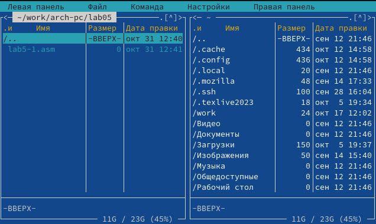
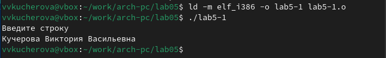

---
## Front matter
title: "Отчёт по лабораторной работе №5"
author: "Кучерова Виктория Васильевна"

## Generic otions
lang: ru-RU
toc-title: "Содержание"

## Bibliography
bibliography: bib/cite.bib
csl: pandoc/csl/gost-r-7-0-5-2008-numeric.csl

## Pdf output format
toc: true # Table of contents
toc-depth: 2
lof: true # List of figures
lot: true # List of tables
fontsize: 12pt
linestretch: 1.5
papersize: a4
documentclass: scrreprt
## I18n polyglossia
polyglossia-lang:
  name: russian
  options:
	- spelling=modern
	- babelshorthands=true
polyglossia-otherlangs:
  name: english
## I18n babel
babel-lang: russian
babel-otherlangs: english
## Fonts
mainfont: IBM Plex Serif
romanfont: IBM Plex Serif
sansfont: IBM Plex Sans
monofont: IBM Plex Mono
mathfont: STIX Two Math
mainfontoptions: Ligatures=Common,Ligatures=TeX,Scale=0.94
romanfontoptions: Ligatures=Common,Ligatures=TeX,Scale=0.94
sansfontoptions: Ligatures=Common,Ligatures=TeX,Scale=MatchLowercase,Scale=0.94
monofontoptions: Scale=MatchLowercase,Scale=0.94,FakeStretch=0.9
mathfontoptions:
## Biblatex
biblatex: true
biblio-style: "gost-numeric"
biblatexoptions:
  - parentracker=true
  - backend=biber
  - hyperref=auto
  - language=auto
  - autolang=other*
  - citestyle=gost-numeric
## Pandoc-crossref LaTeX customization
figureTitle: "Рис."
tableTitle: "Таблица"
listingTitle: "Листинг"
lofTitle: "Список иллюстраций"
lotTitle: "Список таблиц"
lolTitle: "Листинги"
## Misc options
indent: true
header-includes:
  - \usepackage{indentfirst}
  - \usepackage{float} # keep figures where there are in the text
  - \floatplacement{figure}{H} # keep figures where there are in the text
---

# Цель работы

Приобрести практические навыкы работы в Midnight Commander. Освоить инструкции языка ассемблера mov и int.

# Выполнение лабораторной работы

Открываем Midnight Commander(рис. [-@fig:001]).

{#fig:001 width=90%}

Переходим в каталог ~/work/arch-pc и создаем папку lab05(рис. [-@fig:002]).

{#fig:002 width=90%}

Создаем файл lab5-1.asm(рис. [-@fig:003]).

{#fig:003 width=90%}

Открываем файл lab5-1.asm и вводим текст программы(рис. [-@fig:004]).

{#fig:004 width=90%}

Открываем файл lab5-1.asm для просмотра и убеждаемся, что файл содержит текст программы(рис. [-@fig:005]).

{#fig:005 width=90%}

Оттранслируем текст программы lab5-1.asm в объектный файл. Выполняем компоновку объектного файла и запускаем получившийся исполняемый файл(рис. [-@fig:006]), (рис. [-@fig:007]).

{#fig:006 width=90%}

{#fig:007 width=90%}

Скачиваем файл in_out.asm со страницы курса в ТУИС(рис. [-@fig:008]).

{#fig:008 width=90%}

Создаем копию файла lab5-1.asm с именем lab5-2.asm(рис. [-@fig:009]).

{#fig:009 width=90%}

Исправляем текст программы в файле lab5-2.asm с использование подпрограмм из внешнего файла in_out.asm(рис. [-@fig:010]), (рис. [-@fig:011]).

{#fig:010 width=90%}

{#fig:011 width=90%}

В файле lab5-2.asm замените подпрограмму sprintLF на sprint. Разница в том, что sprintLF переводит на новую строку(рис. [-@fig:012]), (рис. [-@fig:013]).

{#fig:012 width=90%}

{#fig:013 width=90%}

# Задание для самостоятельной работы

Создаем копию файла lab5-1.asm и вносим изменения в программу(рис. [-@fig:014]).

{#fig:014 width=90%}

Получаем исполняемый файл и проверяем его работу(рис. [-@fig:015]).

{#fig:015 width=90%}

Создаем копию файла lab5-2.asm. Исправляем текст программы с использованием подпрограмм из внешнего файла in_out.asm(рис. [-@fig:016]).

{#fig:016 width=90%}

Создаем исполняемый файл и проверяем его работу(рис. [-@fig:017]).

{#fig:017 width=90%}

# Выводы

Я приобрела практические навыкы работы в Midnight Commander и освоила инструкции языка ассемблера mov и int.

# Список литературы{.unnumbered}

::: {#refs}
:::
