---
## Front matter
title: "Отчёт по лабораторной работе №6"
author: "Кучерова Виктория Васильевна"

## Generic otions
lang: ru-RU
toc-title: "Содержание"

## Bibliography
bibliography: bib/cite.bib
csl: pandoc/csl/gost-r-7-0-5-2008-numeric.csl

## Pdf output format
toc: true # Table of contents
toc-depth: 2
lof: true # List of figures
lot: true # List of tables
fontsize: 12pt
linestretch: 1.5
papersize: a4
documentclass: scrreprt
## I18n polyglossia
polyglossia-lang:
  name: russian
  options:
	- spelling=modern
	- babelshorthands=true
polyglossia-otherlangs:
  name: english
## I18n babel
babel-lang: russian
babel-otherlangs: english
## Fonts
mainfont: IBM Plex Serif
romanfont: IBM Plex Serif
sansfont: IBM Plex Sans
monofont: IBM Plex Mono
mathfont: STIX Two Math
mainfontoptions: Ligatures=Common,Ligatures=TeX,Scale=0.94
romanfontoptions: Ligatures=Common,Ligatures=TeX,Scale=0.94
sansfontoptions: Ligatures=Common,Ligatures=TeX,Scale=MatchLowercase,Scale=0.94
monofontoptions: Scale=MatchLowercase,Scale=0.94,FakeStretch=0.9
mathfontoptions:
## Biblatex
biblatex: true
biblio-style: "gost-numeric"
biblatexoptions:
  - parentracker=true
  - backend=biber
  - hyperref=auto
  - language=auto
  - autolang=other*
  - citestyle=gost-numeric
## Pandoc-crossref LaTeX customization
figureTitle: "Рис."
tableTitle: "Таблица"
listingTitle: "Листинг"
lofTitle: "Список иллюстраций"
lotTitle: "Список таблиц"
lolTitle: "Листинги"
## Misc options
indent: true
header-includes:
  - \usepackage{indentfirst}
  - \usepackage{float} # keep figures where there are in the text
  - \floatplacement{figure}{H} # keep figures where there are in the text
---

# Цель работы

Освоить арифметические инструкции языка ассемблера NASM.

# Выполнение лабораторной работы

Создадим каталог для программ лабораторной работы № 6, перейдем в него и создадим файл lab6-1.asm(рис. [-@fig:001]).

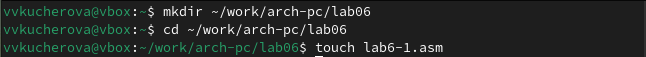{#fig:001 width=90%}

Рассматриваем примеры программ вывода символьных и численных значений. Программы будут выводить значения записанные в регистр eax.Создаем исполняемый файл и запускаем его(рис. [-@fig:002]), (рис. [-@fig:003]).

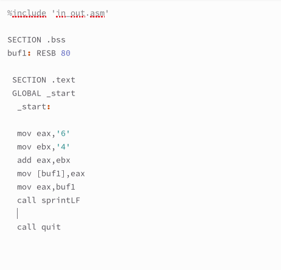{#fig:002 width=90%}

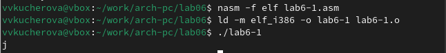{#fig:003 width=90%}

Далее изменяем текст программы и вместо символов, запишем в регистры числа(рис. [-@fig:004]), (рис. [-@fig:005]).

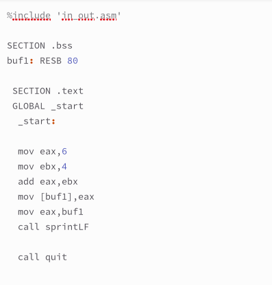{#fig:004 width=90%}

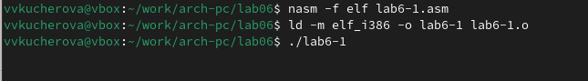{#fig:005 width=90%}

Создаем файл lab6-2.asm в каталоге ~/work/arch-pc/lab06 и вводим в него текст программы(рис. [-@fig:006]), (рис. [-@fig:007]), (рис. [-@fig:008]).

{#fig:006 width=90%}

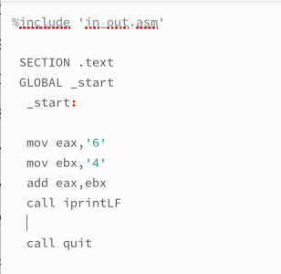{#fig:007 width=90%}

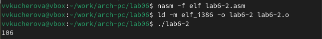{#fig:008 width=90%}

Аналогично предыдущему примеру изменяем символы на числа(рис. [-@fig:009]), (рис. [-@fig:010]).

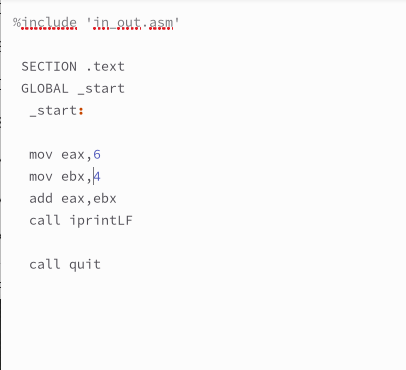{#fig:009 width=90%}

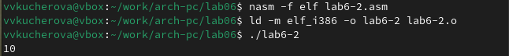{#fig:010 width=90%}

Заменяем функцию iprintLF на iprint(рис. [-@fig:011]), (рис. [-@fig:012]).

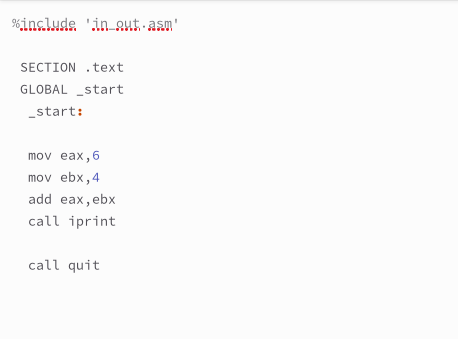{#fig:011 width=90%}

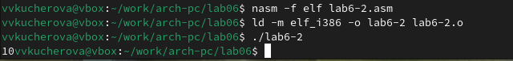{#fig:012 width=90%}

В качестве примера выполнения арифметических операций в NASM приведем программу вычисления арифметического выражения f(x) = (5 * 2 + 3)/3(рис. [-@fig:013]), (рис. [-@fig:014]), (рис. [-@fig:015]).

{#fig:013 width=90%}

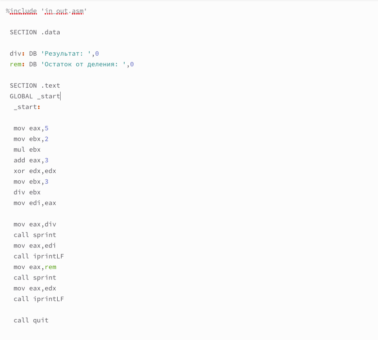{#fig:014 width=90%}

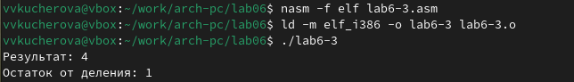{#fig:015 width=90%}

Изменяем текст программы для вычисления выражения f(x) = (4 * 6 + 2)/5. Создаем исполняемый файл и проверяем его работу(рис. [-@fig:016]), (рис. [-@fig:017]).

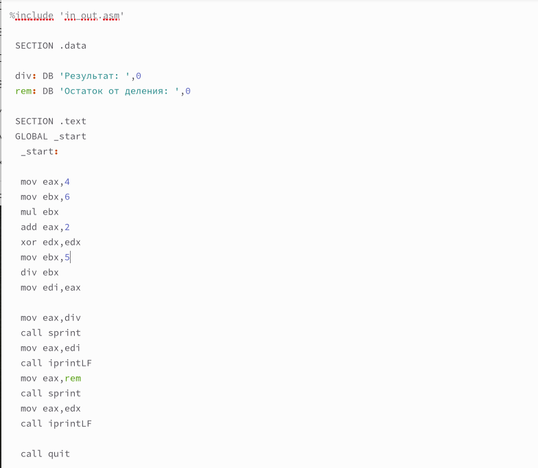{#fig:016 width=90%}

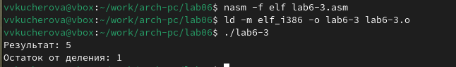{#fig:017 width=90%}

В качестве другого примера рассмотрим программу вычисления варианта задания по номеру студенческого билета(рис. [-@fig:018]), (рис. [-@fig:019]), (рис. [-@fig:020]).

{#fig:018 width=90%}

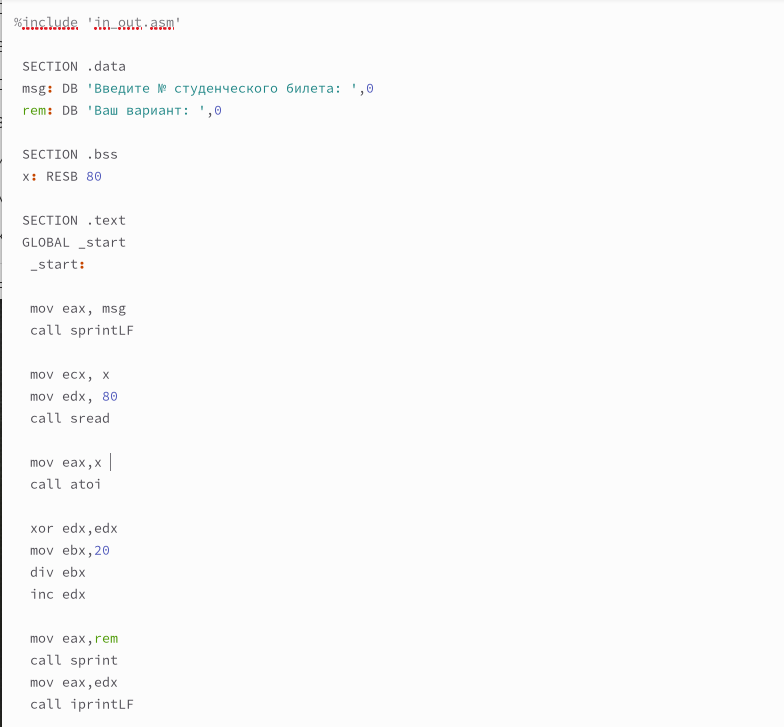{#fig:019 width=90%}

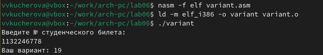{#fig:020 width=90%}

Ответы на вопросы:

1 За вывод сообщения "Ваш вариант" отвечают строки кода:
mov eax,rem
call sprint
    
2 Инструкция mov ecx, x используется, чтобы положить адрес вводимой строки x в регистр ecx mov edx, 80 - запись в регистр edx длины вводимой строки
call sread - вызов подпрограммы из внешнего файла, обеспечивающей ввод сообщения с клавиатуры

3 call atoi используется для вызова подпрограммы из внешнего файла, которая преобразует ascii-код символа в целое число и записывает результат в регистр eax

4 За вычисления варианта отвечают строки:
xor edx,edx ; обнуление edx для корректной работы 
divmov ebx,20 ; ebx = 20
div ebx ; eax = eax/20, edx - остаток от деления
inc edx ; edx = edx + 1
    
5 При выполнении инструкции div ebx остаток от деления записывается в регистр edx

6 Инструкция inc edx увеличивает значение регистра edx на 1

7 За вывод на экран результатов вычислений отвечают строки:

mov eax,edx
call iprintLF

# Задание для самостоятельной работы

Напишем программу вычисления выражения y = f(x) (рис. [-@fig:021]), (рис. [-@fig:022]).

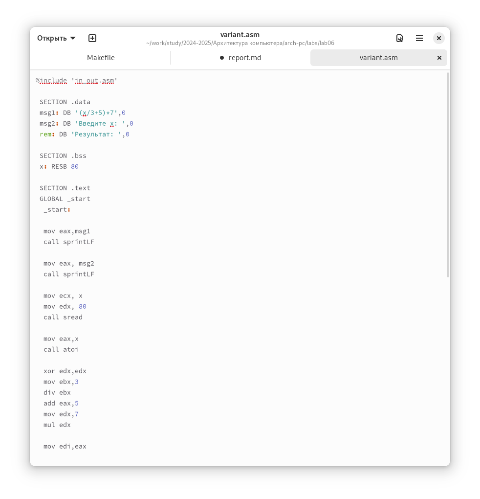{#fig:022 width=90%}

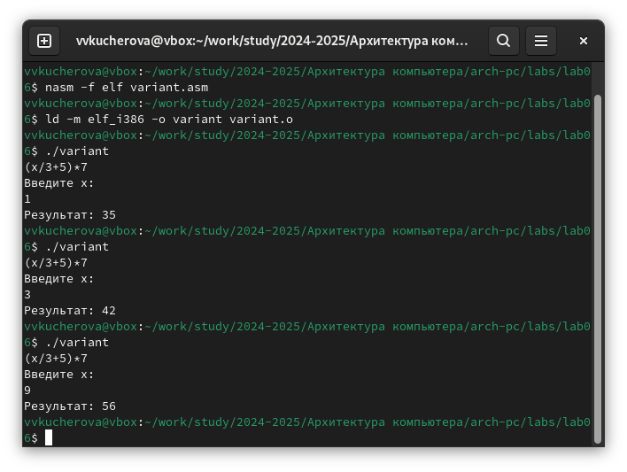{#fig:021 width=90%}

# Выводы

Я освоила арифметические инструкции языка ассемблера NASM.

# Список литературы{.unnumbered}

::: {#refs}
:::
