---
## Front matter
title: "Отчёт по лабораторной работе №7"
author: "Кучерова Виктория Васильевна"

## Generic otions
lang: ru-RU
toc-title: "Содержание"

## Bibliography
bibliography: bib/cite.bib
csl: pandoc/csl/gost-r-7-0-5-2008-numeric.csl

## Pdf output format
toc: true # Table of contents
toc-depth: 2
lof: true # List of figures
lot: true # List of tables
fontsize: 12pt
linestretch: 1.5
papersize: a4
documentclass: scrreprt
## I18n polyglossia
polyglossia-lang:
  name: russian
  options:
	- spelling=modern
	- babelshorthands=true
polyglossia-otherlangs:
  name: english
## I18n babel
babel-lang: russian
babel-otherlangs: english
## Fonts
mainfont: IBM Plex Serif
romanfont: IBM Plex Serif
sansfont: IBM Plex Sans
monofont: IBM Plex Mono
mathfont: STIX Two Math
mainfontoptions: Ligatures=Common,Ligatures=TeX,Scale=0.94
romanfontoptions: Ligatures=Common,Ligatures=TeX,Scale=0.94
sansfontoptions: Ligatures=Common,Ligatures=TeX,Scale=MatchLowercase,Scale=0.94
monofontoptions: Scale=MatchLowercase,Scale=0.94,FakeStretch=0.9
mathfontoptions:
## Biblatex
biblatex: true
biblio-style: "gost-numeric"
biblatexoptions:
  - parentracker=true
  - backend=biber
  - hyperref=auto
  - language=auto
  - autolang=other*
  - citestyle=gost-numeric
## Pandoc-crossref LaTeX customization
figureTitle: "Рис."
tableTitle: "Таблица"
listingTitle: "Листинг"
lofTitle: "Список иллюстраций"
lotTitle: "Список таблиц"
lolTitle: "Листинги"
## Misc options
indent: true
header-includes:
  - \usepackage{indentfirst}
  - \usepackage{float} # keep figures where there are in the text
  - \floatplacement{figure}{H} # keep figures where there are in the text
---

# Цель работы

Изучить команды условного и безусловного переходов. Приобрести навыки написания программ с использованием переходов. Знакомство с назначением и структурой файла листинга.

# Выполнение лабораторной работы

Создадим каталог для программам лабораторной работы № 7, перейдем в него и создадим файл lab7-1.asm(рис. [-@fig:001]).

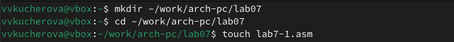{#fig:001 width=90%}

Рассмотрим пример программы с использованием инструкции jmp(рис. [-@fig:002]), (рис. [-@fig:003]). 

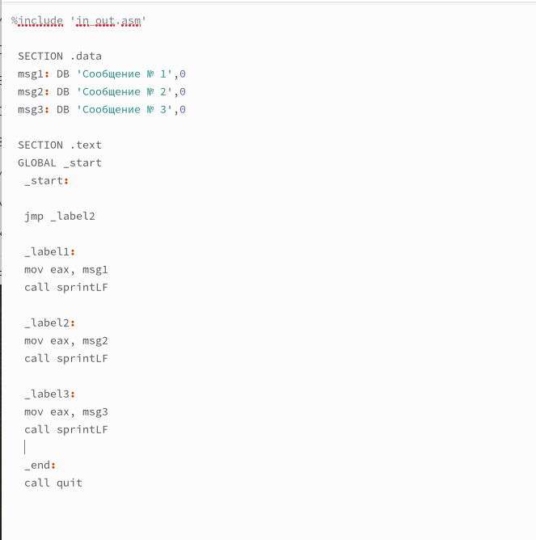{#fig:002 width=90%}

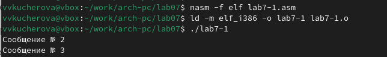{#fig:003 width=90%}

Изменим программу таким образом, чтобы она выводила сначала ‘Сообщение № 2’, потом ‘Сообщение № 1’ и завершала работу(рис. [-@fig:004]), (рис. [-@fig:005]).

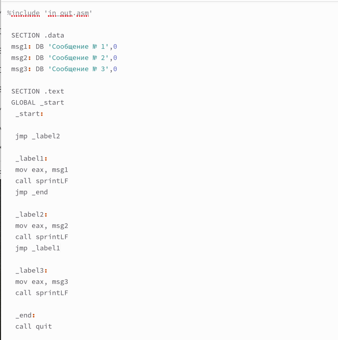{#fig:004 width=90%}

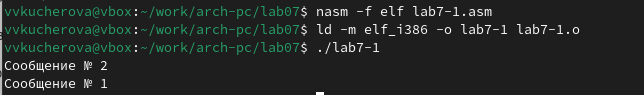{#fig:005 width=90%}

Изменим текст программы еще раз(рис. [-@fig:006]), (рис. [-@fig:007]).

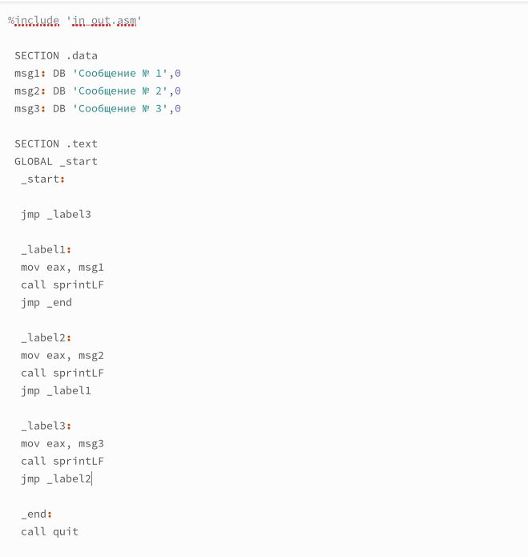{#fig:006 width=90%}

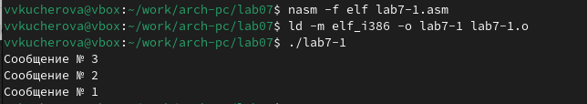{#fig:007 width=90%}

Создадим файл lab7-2.asm в каталоге ~/work/arch-pc/lab07 и введем в него текст программы. Создадим исполняемый файл и проверим его работу для разных значений B(рис. [-@fig:008]), (рис. [-@fig:009]), (рис. [-@fig:010]).

{#fig:008 width=90%}

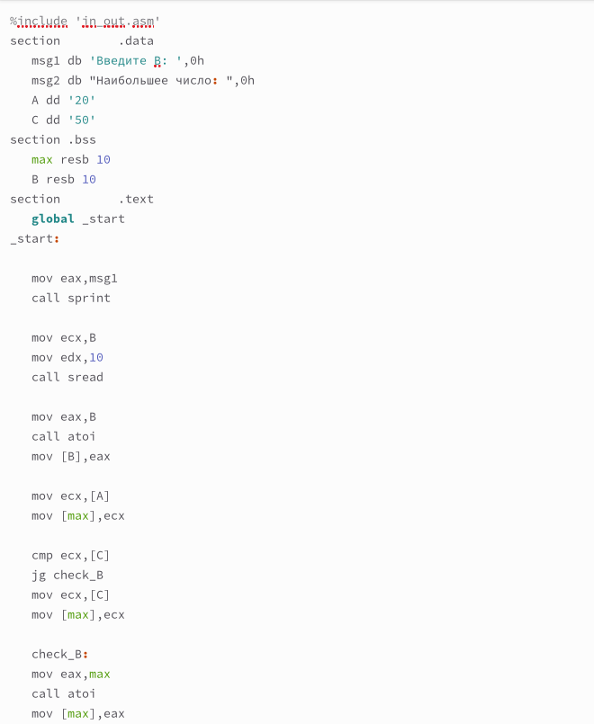{#fig:009 width=90%}

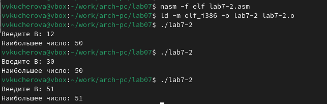{#fig:010 width=90%}

Создадим файл листинга для программы из файла lab7-2.asm. Откроем файл листинга lab7-2.lst с помощью любого текстового редактора(рис. [-@fig:011]).

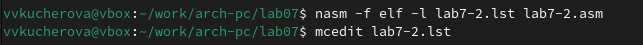{#fig:011 width=90%}

Строка 14 имеет адрес '0000000B' и машинный код 29D8 и выполняет вычитание значения ebx из значения eax. Строка 15 имеет адрес '0000000D' и машинный код 5B и сохраняет значение в регистре ebx. Строка 16 имеет адрес '0000000E' и машинный код C3, используется для возврата из подпрограммы(рис. [-@fig:012]).

{#fig:012 width=90%}

Откроем файл с программой lab7-2.asm и в любой инструкции с двумя операндами удалим один операнд. Программа и листинг выводят ошибку(рис. [-@fig:013]), (рис. [-@fig:014]), (рис. [-@fig:015]).

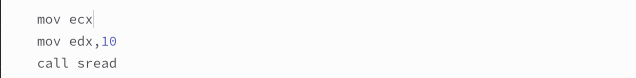{#fig:013 width=90%}

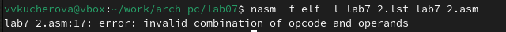{#fig:014 width=90%}

{#fig:015 width=90%}

# Задание для самостоятельной работы

Напишите программу нахождения наименьшей из 3 целочисленных переменных a,b и c(рис. [-@fig:016]), (рис. [-@fig:017]).

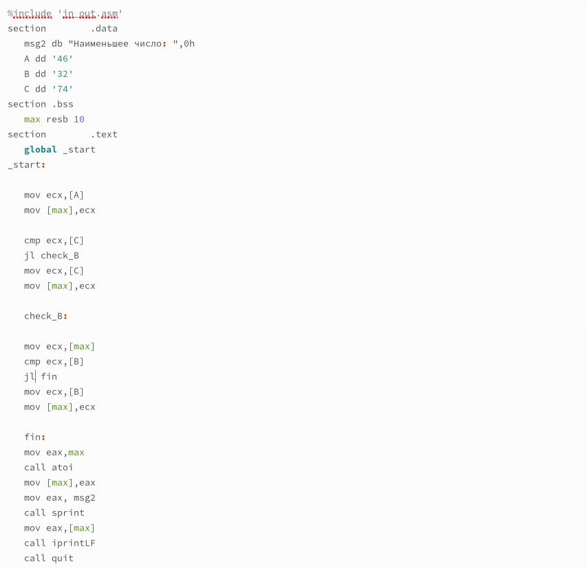{#fig:016 width=90%}

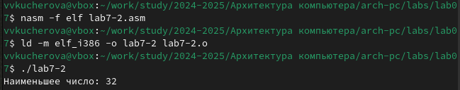{#fig:017 width=90%}

Напишите программу, которая для введенных с клавиатуры значений x и a вычисляет значение заданной функции f(x) и выводит результат вычислений(рис. [-@fig:018]), (рис. [-@fig:019]).

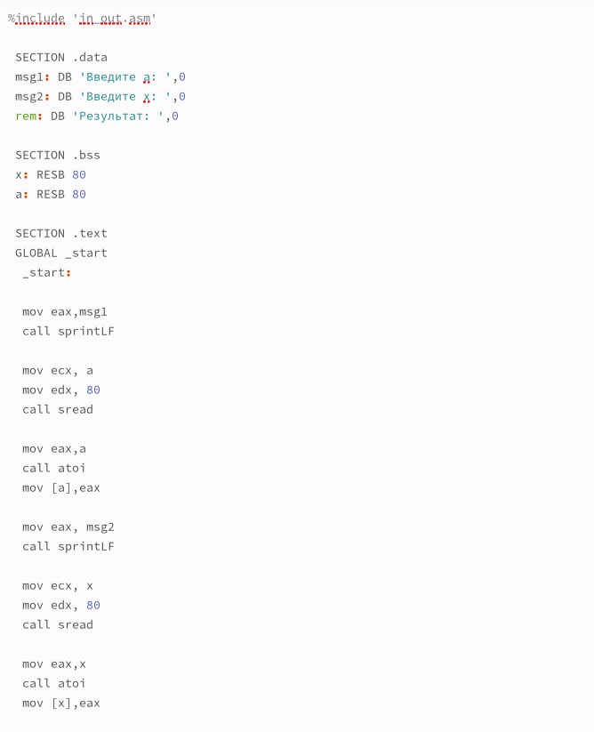{#fig:018 width=90%}

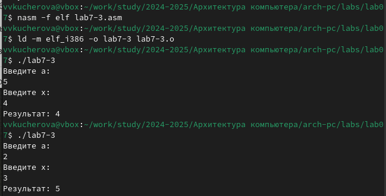{#fig:019 width=90%}

# Выводы

Я изучила команды условного и безусловного переходов. Приобрела навыки написания программ с использованием переходов. Познакомилась с назначением и структурой файла листинга.

# Список литературы{.unnumbered}

::: {#refs}
:::
