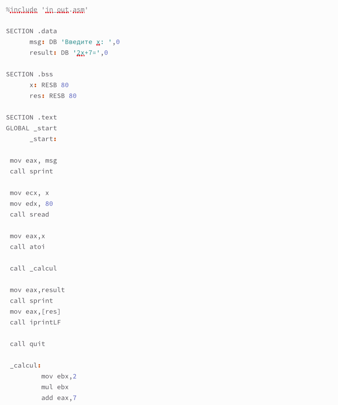
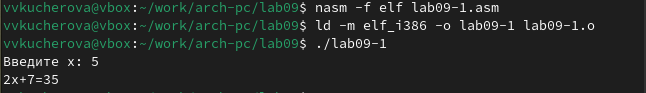
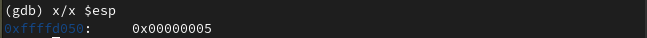

---
## Front matter
title: "Отчёт по лабораторной работе №9"
author: "Кучерова Виктория Васильевна"

## Generic otions
lang: ru-RU
toc-title: "Содержание"

## Bibliography
bibliography: bib/cite.bib
csl: pandoc/csl/gost-r-7-0-5-2008-numeric.csl

## Pdf output format
toc: true # Table of contents
toc-depth: 2
lof: true # List of figures
lot: true # List of tables
fontsize: 12pt
linestretch: 1.5
papersize: a4
documentclass: scrreprt
## I18n polyglossia
polyglossia-lang:
  name: russian
  options:
	- spelling=modern
	- babelshorthands=true
polyglossia-otherlangs:
  name: english
## I18n babel
babel-lang: russian
babel-otherlangs: english
## Fonts
mainfont: IBM Plex Serif
romanfont: IBM Plex Serif
sansfont: IBM Plex Sans
monofont: IBM Plex Mono
mathfont: STIX Two Math
mainfontoptions: Ligatures=Common,Ligatures=TeX,Scale=0.94
romanfontoptions: Ligatures=Common,Ligatures=TeX,Scale=0.94
sansfontoptions: Ligatures=Common,Ligatures=TeX,Scale=MatchLowercase,Scale=0.94
monofontoptions: Scale=MatchLowercase,Scale=0.94,FakeStretch=0.9
mathfontoptions:
## Biblatex
biblatex: true
biblio-style: "gost-numeric"
biblatexoptions:
  - parentracker=true
  - backend=biber
  - hyperref=auto
  - language=auto
  - autolang=other*
  - citestyle=gost-numeric
## Pandoc-crossref LaTeX customization
figureTitle: "Рис."
tableTitle: "Таблица"
listingTitle: "Листинг"
lofTitle: "Список иллюстраций"
lotTitle: "Список таблиц"
lolTitle: "Листинги"
## Misc options
indent: true
header-includes:
  - \usepackage{indentfirst}
  - \usepackage{float} # keep figures where there are in the text
  - \floatplacement{figure}{H} # keep figures where there are in the text
---

# Цель работы

Приобрести навыки написания программ с использованием подпрограмм. Познакомиться с методами отладки при помощи GDB и его основными возможностями.

# Выполнение лабораторной работы

Создадим каталог для выполнения лабораторной работы № 9, перейдем в него и создадим файл lab09-1.asm:(рис. [-@fig:001]).

{#fig:001 width=90%}

Введем в файл lab09-1.asm текст программы. Создадим исполняемый файл и проверим его работу(рис. [-@fig:002]).(рис. [-@fig:003]).

{#fig:002 width=90%}

{#fig:003 width=90%}

Изменим текст программы, добавив подпрограмму _subcalcul в подпрограмму _calcul, для вычисления выражения f(g(x)), где x вводится с клавиатуры(рис. [-@fig:004]).(рис. [-@fig:005]).

{#fig:004 width=90%}

{#fig:005 width=90%}

Создадим файл lab09-2.asm с текстом программы(рис. [-@fig:006]).

{#fig:006 width=90%}

Получим исполняемый файл и загрузим исполняемый файл в отладчик gdb(рис. [-@fig:007]).

{#fig:007 width=90%}

Проверим работу программы, запустив ее в оболочке GDB с помощью команды run(рис. [-@fig:008]).

{#fig:008 width=90%}

Для более подробного анализа программы установим брейкпоинт на метку _start(рис. [-@fig:009]).

{#fig:009 width=90%}

Посмотрим дисассимилированный код программы с помощью команды disassemble начиная с метки _start(рис. [-@fig:010]).

{#fig:010 width=90%}

Переключитесь на отображение команд с Intel’овским синтаксисом. В режиме ATT регистры указываются после их адреса и перед регистром стоит %(рис. [-@fig:011]).

{#fig:011 width=90%}

Включим режим псевдографики для более удобного анализа программы(рис. [-@fig:012]).

{#fig:012 width=90%}

Ранее была установлена точка останова по имени метки (_start). Проверим это с помощью команды info breakpoints(рис. [-@fig:013]).

{#fig:013 width=90%}

Установим еще одну точку останова по адресу инструкции(рис. [-@fig:014]).

{#fig:014 width=90%}

Посмотрим информацию о всех установленных точках останова(рис. [-@fig:015]).

{#fig:015 width=90%}

Выполним 5 инструкций с помощью команды stepi(рис. [-@fig:016]).(рис. [-@fig:017]).(рис. [-@fig:018]).(рис. [-@fig:019]).(рис. [-@fig:020]).

{#fig:016 width=90%}

{#fig:017 width=90%}

{#fig:018 width=90%}

{#fig:019 width=90%}

{#fig:020 width=90%}

Посмотрим значение переменной msg1 по имени(рис. [-@fig:021]).

{#fig:021 width=90%}

Посмотрим значение переменной msg2 по адресу(рис. [-@fig:022]).

{#fig:022 width=90%}

Изменим первый символ переменной msg1(рис. [-@fig:023]).

{#fig:023 width=90%}

Заменим любой символ во второй переменной msg2(рис. [-@fig:024]).

{#fig:024 width=90%}

Выведем в различных форматах значение регистра edx(рис. [-@fig:025]).

{#fig:025 width=90%}

С помощью команды set изменим значение регистра ebx. В первом случае мы вносим значение 2, а во втором регистр равен 2(рис. [-@fig:026]).

{#fig:026 width=90%}

Выйдем из GDB(рис. [-@fig:027]).

{#fig:027 width=90%}

Скопируем файл lab8-2.asm в файл с именем lab09-3.asm и создадим исполняемый файл(рис. [-@fig:028]).

{#fig:028 width=90%}

Загрузим исполняемый файл в отладчик, указав аргументы(рис. [-@fig:029]).

{#fig:029 width=90%}

Для начала установим точку останова перед первой инструкцией в программе и запустим ее(рис. [-@fig:030]).

{#fig:030 width=90%}

Адрес вершины стека храниться в регистре esp и по этому адресу располагается число равное количеству аргументов командной строки(рис. [-@fig:031]).

{#fig:031 width=90%}

Посмотрим остальные позиции стека. Элементы расположены с интервалом 4, так как стек может хранить до 4 байт, и для того чтобы данные сохранялись нормально без помех, компьютер использует новый стек для новой информации(рис. [-@fig:032]).

{#fig:032 width=90%}

# Задание для самостоятельной работы

Преобразуем программу из лабораторной работы №8, реализовав вычисление значения функции f(x) как подпрограмму(рис. [-@fig:033]).(рис. [-@fig:034]).

{#fig:033 width=90%}

{#fig:034 width=90%}

При запуске данная программа дает неверный результат. Проверим это. С помощью отладчика GDB,
анализируя изменения значений регистров, определим ошибку и исправьте ее. Ошибка в том что сумма записывается в ebx, а на 4 умножается eax(рис. [-@fig:035]).(рис. [-@fig:036]).(рис. [-@fig:037]).(рис. [-@fig:038]).

{#fig:035 width=90%}

{#fig:036 width=90%}

{#fig:037 width=90%}

{#fig:038 width=90%}

# Выводы

Я приобрела навыки написания программ с использованием подпрограмм. Познакомилась с методами отладки при помощи GDB и его основными возможностями.

# Список литературы{.unnumbered}

::: {#refs}
:::
