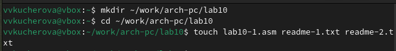
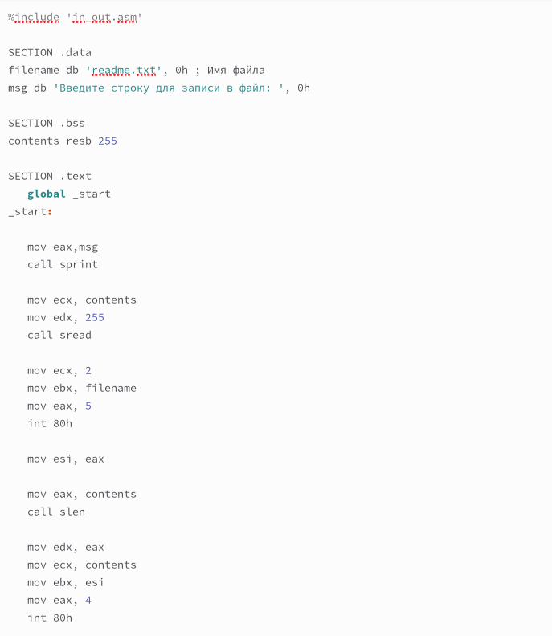
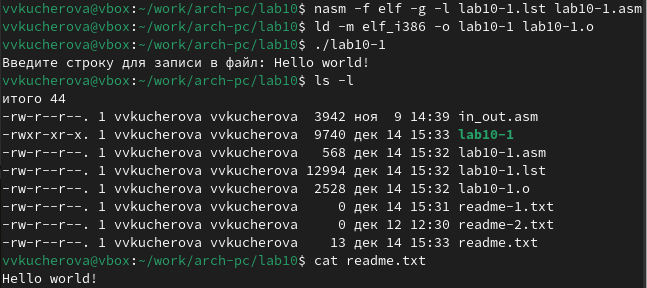
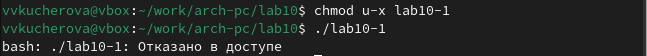
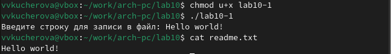
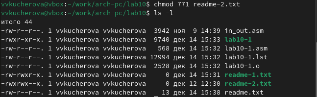
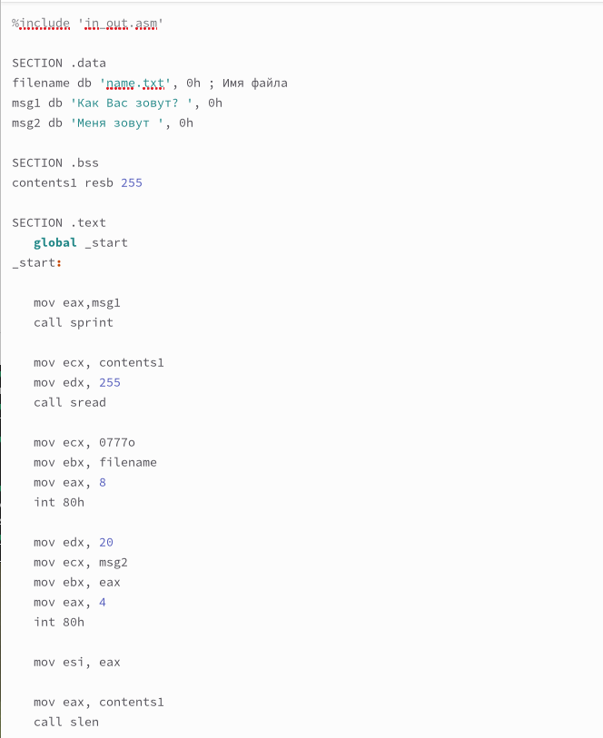
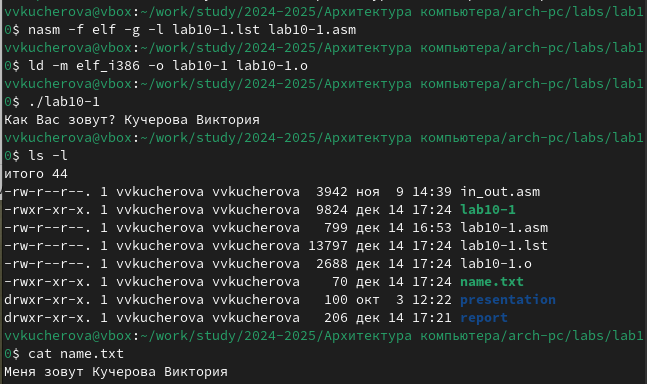

---
## Front matter
title: "Отчёт по лабораторной работе №10"
author: "Кучерова Виктория Васильевна"

## Generic otions
lang: ru-RU
toc-title: "Содержание"

## Bibliography
bibliography: bib/cite.bib
csl: pandoc/csl/gost-r-7-0-5-2008-numeric.csl

## Pdf output format
toc: true # Table of contents
toc-depth: 2
lof: true # List of figures
lot: true # List of tables
fontsize: 12pt
linestretch: 1.5
papersize: a4
documentclass: scrreprt
## I18n polyglossia
polyglossia-lang:
  name: russian
  options:
	- spelling=modern
	- babelshorthands=true
polyglossia-otherlangs:
  name: english
## I18n babel
babel-lang: russian
babel-otherlangs: english
## Fonts
mainfont: IBM Plex Serif
romanfont: IBM Plex Serif
sansfont: IBM Plex Sans
monofont: IBM Plex Mono
mathfont: STIX Two Math
mainfontoptions: Ligatures=Common,Ligatures=TeX,Scale=0.94
romanfontoptions: Ligatures=Common,Ligatures=TeX,Scale=0.94
sansfontoptions: Ligatures=Common,Ligatures=TeX,Scale=MatchLowercase,Scale=0.94
monofontoptions: Scale=MatchLowercase,Scale=0.94,FakeStretch=0.9
mathfontoptions:
## Biblatex
biblatex: true
biblio-style: "gost-numeric"
biblatexoptions:
  - parentracker=true
  - backend=biber
  - hyperref=auto
  - language=auto
  - autolang=other*
  - citestyle=gost-numeric
## Pandoc-crossref LaTeX customization
figureTitle: "Рис."
tableTitle: "Таблица"
listingTitle: "Листинг"
lofTitle: "Список иллюстраций"
lotTitle: "Список таблиц"
lolTitle: "Листинги"
## Misc options
indent: true
header-includes:
  - \usepackage{indentfirst}
  - \usepackage{float} # keep figures where there are in the text
  - \floatplacement{figure}{H} # keep figures where there are in the text
---

# Цель работы

Приобрести навыки написания программ для работы с файлами.

# Выполнение лабораторной работы

Создадим каталог для программам лабораторной работы № 10, перейдем в него и создадим файлы lab10-1.asm, readme-1.txt и readme-2.txt(рис. [-@fig:001]).

{#fig:001 width=90%}

Введем в файл lab10-1.asm текст программы. Создадим исполняемый файл и проверим его работу(рис. [-@fig:002]), (рис. [-@fig:003]).

{#fig:002 width=90%}

{#fig:003 width=90%}

С помощью команды chmod изменим права доступа к исполняемому файлу lab10-1, запретив его выполнение. Выдало отказ в доступе, так как я запретила запускать программу для владельца (рис. [-@fig:004]).

{#fig:004 width=90%}

С помощью команды chmod измените права доступа к файлу lab10-1.asm с исходным текстом программы, и она выполнилась(рис. [-@fig:005]). 

{#fig:005 width=90%}

Предоставим права доступа к файлу readme-1.txt представленные в символьном виде, а для файла readme-2.txt – в двочном виде. Проверим правильность выполнения(рис. [-@fig:006]), (рис. [-@fig:007]). 

{#fig:006 width=90%}

{#fig:007 width=90%}

# Задание для самостоятельной работы

Напишем программу работающую по следующему алгоритму(рис. [-@fig:008]), (рис. [-@fig:009]):
• Вывод приглашения “Как Вас зовут?”
• ввести с клавиатуры свои фамилию и имя
• создать файл с именем name.txt
• записать в файл сообщение “Меня зовут”
• дописать в файл строку введенную с клавиатуры
• закрыть файл

{#fig:008 width=90%}

{#fig:009 width=90%}

# Выводы

Я приобрела навыки написания программ для работы с файлами.

# Список литературы{.unnumbered}

::: {#refs}
:::
